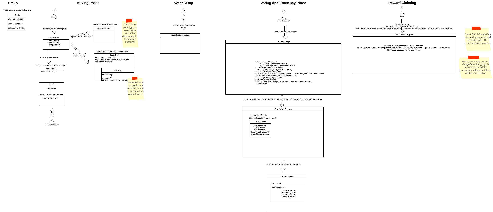

# Vota

Monorepo that houses the programs and utilities for the BRB ecosystem.

### programs/vote-market
The on-chain program for the vote market. 

Set a new key to yor solana cli config key. 
Set the KEY_PATH environment variable in `.env` or in you shell to your new key, then run:

```bash
cargo -p account-gen
anchor test 
```
The account-gen command is only needed when the keypair is changed.


### external-state/account-gen
Executable for processing accounts needed on the localhost validator for testing. This
will generate the accounts to work with the Keypair at the path specified in the KEY_PATH
envorinment variable.

Run this at root level to generate the the accounts in test-accounts 
```bash
cargo run -p account-gen
```

### external-state/gauge-state
Crate copying the relevant parts of the [Quarry Gauge Repo](https://github.com/QuarryProtocol/gauge). T
This creates a crate compatible with Anchor 0.29.0 for composing with the program.

### external-state/locked-voter-state
Crate copying the relevant parts of the [Tribeca Locked Voter](https://github.com/TribecaHQ/tribeca/tree/master/programs/locked-voter). T
This creates a crate compatible with Anchor 0.29.0 for composing with the program.

## Saber Vote Market

On-chain program and off-chain scripts for implementing a vote market built on top of [Quarry Protocol](https://github.com/QuarryProtocol/quarry), interacting with Quarry [gauges](https://github.com/QuarryProtocol/gauge) and the Tribeca Protocol [locked-voter](https://github.com/TribecaHQ/tribeca/tree/master/programs/locked-voter) program.

### Initial Design

