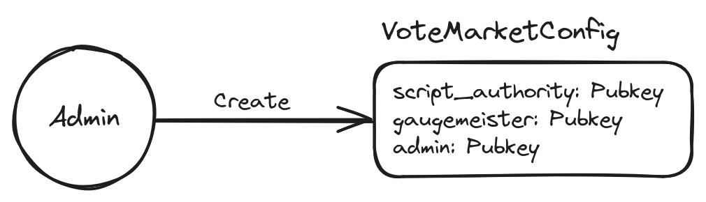
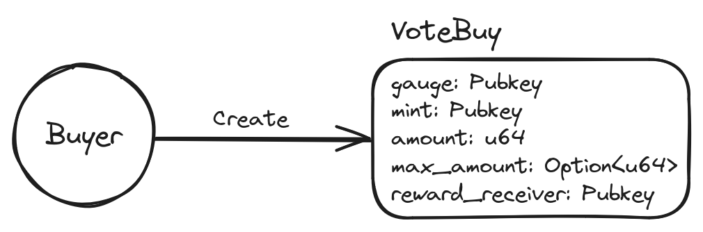

# Vota


A Solana-based protocol for trading votes for money.

## Testing

To run tests, first duplicate `.env.example` to `.env` and change `KEY_PATH` and `KEY_PATH2`
to valid paths to keypairs. Then run:

```bash
cargo run -p account-gen
anchor test 
```

The account-gen command is only needed when the keypair is changed.

## Repository Structure

This repo contains a few modules:
- `programs/vote-market`: the on-chain program
- `external-state/account-gen`: an executable for creating the accounts needed on the localhost
validator for testing
- `external-state/gauge-state`: a stub that allows the vote market program to
compose with the [Quarry gauge program](https://github.com/QuarryProtocol/gauge)
- `external-state/locked-voter-state`: a stub that allows the vote market program
to compose with the [Tribeca locked voter program](https://github.com/TribecaHQ/tribeca/tree/master/programs/locked-voter)
- `off-chain/vote-market-manager`: a CLI executable for operating the vote market,
including voting on behalf of users and sending rewards to users

## Flow

First, an admin must create a `VoteMarketConfig` account. This contains an `admin`, a 
`script_authority`, and a `gaugemeister`.



The script authority is the one who has the ability to vote on behalf of users. The admin
can change the script authority and other various parts of the program.

After a `VoteMarketConfig` has been created, vote buyers can create `VoteBuy`s. `VoteBuy`s are
specific to a gauge and epoch and contain an amount of tokens that constitute the vote payment.
Tokens need to be whitelisted by an admin before they can be used to buy votes.



